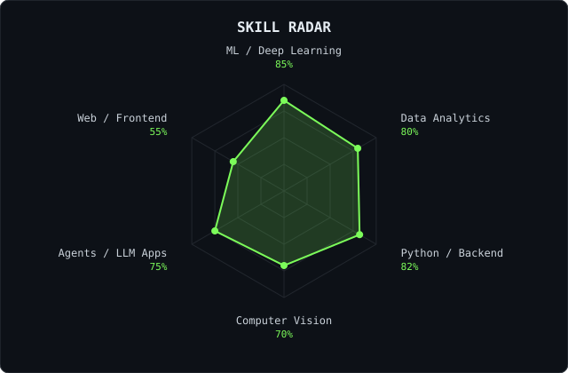

<div align="center">


<br/>

<a href="https://linkedin.com/in/YOUR-LINKEDIN-HANDLE"></a>
<a href="mailto:pundhir.ayush9@gmail.com"></a>
<a href="https://YOUR-PORTFOLIO-URL"></a>
<a href="https://x.com/YOUR-X-HANDLE"></a>

<br/><br/>


</div>

---

## ~/ whoami

```bash
$ cat about.txt

Hi, I'm Ayush Pundhir, a third-year AI & Data Science student
based in Bengaluru, IN.

I build ML and agentic systems that have to work outside the
notebook: real data, real users, real constraints.

  > Built NetraOne          - facial-recognition prototype for police (AI Lead)
  > Built an AI assistant   - Telegram + n8n + OpenAI + Google Workspace + MongoDB
  > Built Transactable.AI   - agent commerce gateway (Razorpay Buildathon)
  > MSME grant recipient · published research · patent filing
  > Studying @ CMR Institute of Technology · class of 2027
```

---

## ~/ toolbox

<p>
  
</p>

---

## ~/ skill radar

<p align="center">
  
  
</p>

<sub>Skill radar is a self-assessment. Language mix is computed live from public repo byte counts, so it reflects code volume, not effort.</sub>

---

## ~/ contribution calendar

<p align="center">
  
</p>

<p align="center">
  
</p>

---

<p align="center"><sub><code>Ship it. Then explain it.</code></sub></p>
